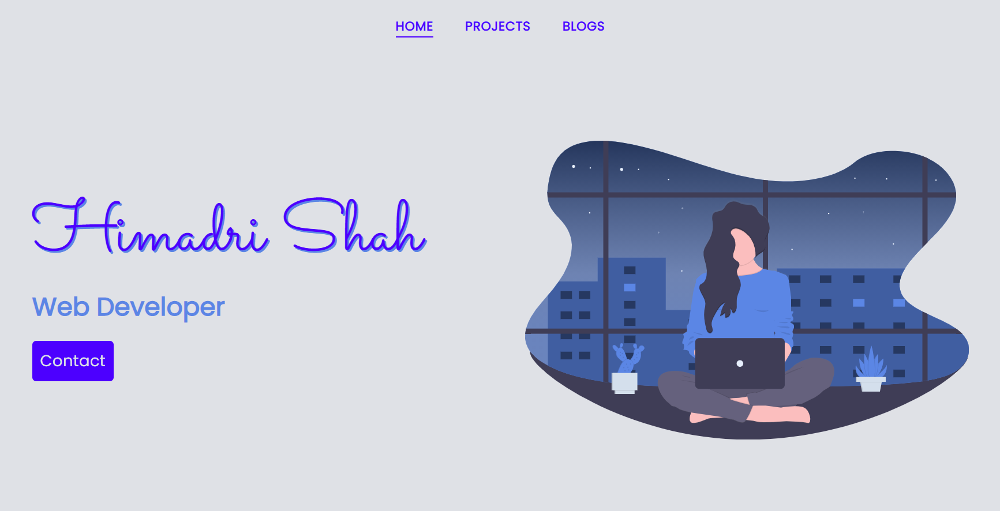

# portfolio

Personal Portfolio website

## Live

[Himadri Shah](http://himadrishah.tech/)

## About

- A brief introduction about myself

## Skills

- A list of all the skills I possess, which includes both coding languages and tools

## Projects

- All levelZero projects of [neoGcamp](https://neog.camp)
- Personal projects that I have built to test my skills
- An internship project which I built during my Web Developement Internship at The Sparks Foundation

## Blogs

- Blogs that I have written on [Hashnode](https://hashnode.com/@himadri2110)

## Contact

- Links to all my social media accounts
